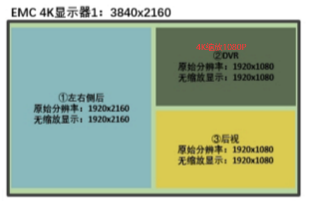

### 根据新的两个需求

需求1：

实现：

需求2：

实现：

### 注意：

因为需对两个需求进行测试，故用宏定义进行声名测试哪一个

若测试3路视频混合，则#define   TESE_3_MIX   1

若测试第四路缩放，则#define    TESE_3_MIX   0

### 另外：

由于vpss IP核支持缩放的最大行数为4320，则第四路1600*5120超过范围，故先用由HLS编写的行降采样IP:v_vsample进行降采样为：1600 * 2560

v_vsample IP的最大行列数参数必须设置为输入图像源实际参数

#### 对于新增的视频格式，需注意：

